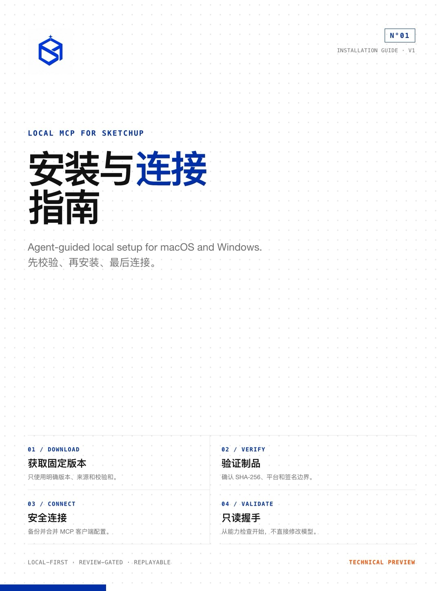

# Installation

<p align="center">
  
</p>

An unsigned plugin-only technical preview is publicly available as
`v0.1.0-rc.4.unsigned.1`. It is not the final one-line installer and does not
include the local MCP service or bundled Node.js. Users who want an Agent to
download, verify, and guide the preview installation should start with
[INSTALL_FOR_AGENTS.md](../INSTALL_FOR_AGENTS.md).

The source steps below remain for local review and must not be presented as the
final end-user installer.

## Public unsigned preview

The same preview RBZ is available from:

- [Gitee](https://gitee.com/dtzhlq/local-mcp-for-sketchup/releases/tag/v0.1.0-rc.4.unsigned.1)
- [GitHub](https://github.com/dtzhlq/local-mcp-for-sketchup/releases/tag/v0.1.0-rc.4.unsigned.1)

File:
`local-mcp-for-sketchup-0.1.0-rc.4-nonrelease-unsigned-preview.rbz`

SHA-256:
`4d3517ed90654bddc278cf3c099c5c240816b65dcd2e75fe15c8465dd46c398a`

This preview can be downloaded and checked without cloning the repository.
SketchUp may refuse to load it under a strict Extension Loading Policy. Do not
lower that policy. Import it through SketchUp Extension Manager only after
acknowledging that it is an unsigned technical preview.

## Requirements

- SketchUp 2026
- macOS Apple Silicon or Windows x64
- Node.js 24 for a source checkout
- Ruby available to run the extension syntax checks

Official release service bundles are planned to carry their own Node.js
runtime, so end users will not need a separate Node installation.

## Source review

```text
npm ci
npm run core:check
```

To generate a locally reviewable, explicitly non-release RBZ:

```text
npm run plugin:package -- \
  --output-dir out/previews/local-review \
  --artifact-label local-review
```

The resulting file is unsigned. In SketchUp, open Extension Manager and choose
Install Extension. Depending on SketchUp's loading policy, an unsigned extension
may not load.

Do not upload this preview package to a download channel. The formal release
flow packages a clean source revision, uploads the exact RBZ to the SketchUp
Extension Signing Portal without encryption, downloads the signed result, and
then recalculates all checksums.

Release-candidate service bundles use `--candidate` and canonical file names,
but their embedded metadata still records `release_artifact=false` and
`release_acceptance=false`. They become publishable only after the signed RBZ,
platform acceptance evidence, and final manifest all bind to the same source
commit.

## Starting the MCP server from source

```text
node src/mcp-server.mjs
```

Use an absolute path to both Node and `src/mcp-server.mjs` in the MCP client
configuration. See [AGENT_INSTALL.md](AGENT_INSTALL.md) for safe merge and
manual fallback rules.

## Uninstall

Remove `local_mcp_for_sketchup.rb` and the `local_mcp_for_sketchup/` directory
through SketchUp's extension management workflow, then remove the local service
directory and its MCP client entry.

Uninstall does not automatically remove:

- user models;
- MCP client configuration backups;
- `~/.local-mcp-for-sketchup` local state;
- generated evidence in a source checkout's `output/` directory.

Inspect and delete those separately only when no longer needed.
