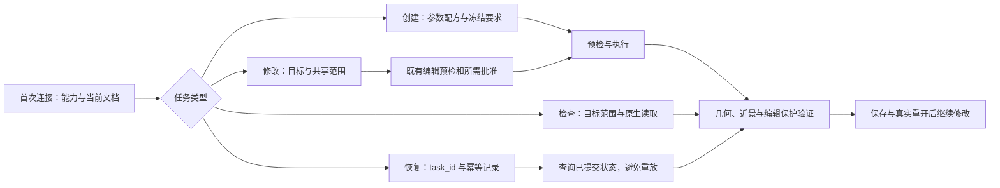

# 普通模型易用性启动基线

核查日期：2026-09-08。本页保留启动时的源码、公开配置、已保存交付证据及本机运行状态；启动核查未重新建模、未打开或关闭模型、未发送模型供应商请求、未读取凭证。后续实现与实机准备见末尾补记，不能把启动快照当作当前实时状态。

## 启动结论

前置精细建模与原生 PBR/HDR 任务已有两套最终 SKP 和对应本机验收记录，可启动易用性实现。启动时可确认的是旧任务交付及可复用工程基线；本计划的三模型固定集合对照未形成完整实机成绩。

`detail-modeling-implementation-checklist.md` 顶部最终状态和 `detail-modeling-delivery-2026-09-07.md` 已覆盖下方阶段历史中的未完成表述。此次直接读取两套 SKP 并计算 SHA-256，均与 `output/detail-modeling-implementation-2026-09-06/final-delivery.json` 一致。

| 最终文件（位于上述输出目录的 `models/`） | 实读字节数 | SHA-256 |
| --- | ---: | --- |
| kitchen-living-v1-delivery-final-v1.skp | 37081552 | `cf2f46c19673a342d8fa68f72086c1f3a8d5888e65c270ce04342c66e7b8a36e` |
| entry-court-v1-delivery-final-v2.skp | 36655089 | `40656eb2272333496927fea72e094fe29b376c8bab75a244a38ccdab21a5edfd` |

两项 `evidence/<场景>/delivery-final-v*/final-acceptance.json` 均声明 accepted，直接引用的几何保留、外观、局部修改和视觉记录均实际存在；两套最终图及 `cold-captures/cold-final-overview.png` 均为非空文件。两项 `cold-acceptance.json` 记录真实退出重开后的根对象、原生外观、文件保持和捕获恢复通过。入口最终记录为 166 个修订铺装部件、36 条场景级水路检查通过。

此处复用已归档的视觉判断，没有在本轮重新进行原生视觉验收。厨房较早的 `visual-review.json` 仍留有 `remaining_technical_step` 冷重开文字，但独立 `cold-acceptance.json` 和最终记录已覆盖该步骤，不能据此重复运行整套旧验收。PNG 不逐字节一致；不宣称逐像素相同。旧任务兼容范围为 macOS SketchUp 2026 26.2.242，未外推至 Windows、SketchUp 2025、任意边 CAD 倒圆、施工深化或第三方渲染器。

## 固定软件与接口基线

- Git 基线：`de7d482863ca4cc52dba40141f69d3d5ee295967`，提交标题 `feat: deliver detailed modeling and native PBR HDR workflows`。
- package 版本：`0.1.0-rc.3`；本机 Node：`v24.12.0`。
- 已安装应用 `CFBundleVersion`：SketchUp `26.2.242`；`CFBundleShortVersionString` 为 `26.2`。
- 归档原生能力：`output/detail-modeling-implementation-2026-09-06/evidence/runtime-kitchen-canonical-v1/capabilities.json`，capability version `0.1.0-rc.3-detail-alpha.1`，manifest version `2026-09-detail-modeling-alpha.1`。这是此前会话回执，不是本轮新鲜握手。
- 最后旧任务离线报告：`output/detail-modeling-offline-2026-09-07T07-27-16-809Z-xAnA5v/report.json`，`ok=true`；明确 `live_runtime_executed=false`、`release_acceptance=false`。完整交付报告记录 58/58，本轮不重复把该报告当作新变更通过证据。
- 初始读取时工作树已有大量修改，主要涉及 `projects/image-structured-modeler/` 和 `package.json`。这些属于既有工作，不清理、不覆盖、不纳入本计划完成声明。

以下源码在核查时与上述 Git 基线字节一致，后续实现应与该固定版本对照：

| 路径 | 基线 SHA-256 |
| --- | --- |
| src/agent-gateway.mjs | `eec4d2a3be0fffaaf7962add043c0491dad5ea79f77d68d50c6ce32775f05cc4` |
| src/mcp-server.mjs | `88276e1a34ebbdf157ca9fc57d0eb2548e4a26ff91ec5da17150086338b5ec2d` |
| src/agent-response-projection.mjs | `3deb89d06794c416812f5b8b40114be72bb0b99d44a34c0b9a3616a553eb1fd1` |
| src/agent-contract.mjs | `9703060791f6c372f98889c3fc4687c97ab769e6850811366add9df41ef1b407` |
| src/capabilities.mjs | `45f9f711dc17fa78c9d3d6df58288eecdf28ef85e6334421afeefa9cf9da22a4` |
| src/detailed-modeling/recipes.mjs | `c27b4bdc711b7d32778fe8cdecfd7f1ad729c3acbe0b09678a2ef107b8004f43` |
| sketchup_plugin/alma_sketchup_mcp.rb | `a6d6372d700a621442f5fc842859adf2bca907bdc499a3616c144a2b82239623` |

已安装的 `~/Library/Application Support/SketchUp 2026/SketchUp/Plugins/alma_sketchup_mcp.rb` 与表中入口文件哈希一致；没有据此宣称整个已安装插件目录或当前运行插件已验证。

## 启动时运行状态快照

启动核查的 `ps` 未发现 SketchUp 进程。默认状态目录 `~/.sketchup-mcp-replica/` 的 `queue`、`processing`、`responses`、`read-only-cancellations` 均为空，`queue-runtime.lock` 不存在。后续已启动的实机会话不与这条历史观察矛盾。

这些只证明核查时未见占用或积压，不证明 Bridge 已运行。首次实机运行前仍需启动单一 SketchUp 会话、读取新鲜 capabilities/session state、确认测试文档和已安装源码版本。实机任务一次只保留一个测试模型，保存证据后关闭并正常退出，以免重现多窗口内存耗尽。

## 启动时首次接入路径与可复用能力

| 已有能力 | 可复用实现 | 启动时限制或改进方向 |
| --- | --- | --- |
| 四工具持久任务 | `start_agent_task`、`resume_agent_task`、`submit_agent_task_input`、`read_agent_artifact` | 公开 `inputs`/`input` 仍是自由 object，首次调用方难以发现具体参数契约。 |
| 八类详细构件、家具与组合 | `src/detailed-modeling/recipes.mjs`、`furnishing-assets.mjs`、`compose-design.mjs` | 内部函数和文档已存在，普通模型仍须自行准备 DSL、detail spec、view 等；缺统一按任务发现的简明入口。 |
| 幂等与故障恢复 | Gateway task store、mutation receipt、`resumeAgentTask` 恢复分支 | 有恢复机制，不应重建；需将内部恢复动作转成实际四工具之一的合法下一次调用。 |
| 编辑前置核验 | `observeExistingModelEditExecutionState`，版本、目标、共享实例和授权约束 | 预检分散在操作与审核管线中；需统一展示可确定的问题和仍须实机测量的问题。 |
| 冻结质量要求 | `detail-quality.mjs`，原生几何、视图、场景净空和资源预算 | 不可把编译成功或预检通过升级为原生几何/视觉通过。 |
| 局部修正上限 | Gateway `per_part_failure_streak` 与 `count >= 3` 门禁 | 已有三轮限制；新增入口需复用且准确回显耗尽状态。 |
| 短上下文投影 | `agent-response-projection.mjs`，默认 4096 字符及 opaque artifact 分页 | create/verify 最小投影已保留质量结论与 evidence level；多数 `next_action.arguments` 仅特定 reviewed-edit 分支保留，需要补齐可执行下一步且维持长度上限。 |
| 单实例/关联实例编辑 | DesignIntent、assembly replacement、既有编辑审核 | 不能用缩放近似替代参数重编译，不能把单个实例目标自动扩大为全部关联实例。 |
| 原生 PBR/HDR | appearance/environment 模块和原生回读 | 需向初次调用方明确版本、资源来源、真实纹理尺度及不支持项。 |

阶段一观察问题：通用 `action` 名（如 `correct_input`、`create_queue_handshake`）本身未保证与四个公开工具的名称和参数对应；完成响应通常终止在质量结果，文件交付条件需要明确表达。应先把最短可用路径与错误修正路径做到可调用，再用模型盲测验证理解效果。

## 启动时模型测试路线与资源待定项

已有 `scripts/run-agent-compatibility-harness.mjs` 和 L0/L1/L2 simulator，可验证工具面、上下文长度、JSON 文本传输、幂等和授权门禁。L0/L1/L2 是模拟客户端能力档位，不是三种真实模型。

已有 `scripts/run-independent-agent-compatibility-probe.mjs` 与 `scripts/independent-agent-probe-tool.mjs` 可复用隔离目录、独立 Codex CLI 进程、四工具 adapter 和 hash-chained audit；runner 支持 `--model` 和 `--codex-bin`。默认 CLI 路径仍为 `/Applications/ChatGPT.app/Contents/Resources/codex`，使用前需实际定位。历史三次独立进程测试均为 mock、只读，模型版本未独立钉住；prompt 给了操作步骤和 JSON，不能计入本计划的无指导首次使用结果。详见 `docs/agent-compatibility-harness-v1.md`。

此次公开 `src/`、`scripts/`、`docs/` 搜索未发现已配置的多供应商模型 API 对照执行器或本计划费用预算；未读取账户、环境密钥或凭证文件。这不意味着用户没有可用模型账户。

实际三模型对照前需要明确：

1. 至少三个允许使用且可钉版本的工具调用模型、访问路线与配置；不预设必须跨品牌。
2. 本轮允许消耗的模型额度或费用上限，以及达到上限后的停止条件；不自动购买服务。
3. SketchUp 实机可用窗口、测试副本范围及保存目录。运行前核对既有授权是否已覆盖，不为低风险准备工作反复请求确认。

这些条件未齐时可继续契约、发现、预检、结果投影、固定验收集和离线故障验证；不能把它们标成三模型实机验收已完成。既有最终 SKP 作为旧任务证据保留，不在新测试中覆盖。

## 2026-09-08 实施补记

本节是文档更新时的代码与已落盘证据核对，不覆盖上述历史基线。完整操作说明见 [quickstart](model-accessibility-quickstart.md)。

| 启动缺口 | 已实现内容 | 仍保留的边界 |
| --- | --- | --- |
| 首次调用方猜 DSL 和规格 | `discover` / `preflight_model`、五类 `inputs.task`、参数与负例目录 | 预检不测量原生几何，不替用户补重要设计输入。 |
| 已保存模型的签名因路径脱敏失效 | `discover/connect` 在 `private.connection.session_contract` 保存原始签名，仅公开 `connection_task_id` / 到期时间；start 与 submit 服务端解析 | 只读连接不打开或授权修改模型；签名仍校验会话、文档、revision 和到期。 |
| 创建结果缺少四工具保存入口 | `start_agent_task(intent=deliver_model)` 绑定已完成的 queue 创建任务、冻结质量通过及当前原生模型；在服务器唯一新路径保存 SKP，返回哈希、字节和 artifact | 保存完整当前文档，不接受任意路径或覆盖；`live_saved_file` 不等于冷重开，`cold_reopen_verified=false`。其他来源任务不能借用该通过结论。 |
| 保存重试可能重复写入 | 保存前持久独占目录和签名意图，完成后签名凭据；原保存 `task_id` 的 resume 仅凭完成凭据恢复返回 | 有文件但无完成凭据时保留 `MUTATION_RECOVERY_REQUIRED`，不再调用保存，不自动关闭或重开。 |
| 缺参和短响应恢复不明确 | 原任务补参、start/submit 稳定幂等键、4096 字符投影中的执行/质量/证据/恢复状态 | 创建后冻结 task/spec；既有部件修改继续走审查，未通过且仍 awaiting_input 的原创建任务可 reverify。completed 任务不重新接收输入，三轮上限未改变。 |
| 其他常见操作不容易发现 | 第 5–15 类的 11 条语义、必填输入、真实工具和限制说明 | 完整根导入、详细装配参数准备、PBR/HDR 与冷重开仍有专家或宿主依赖。四工具专用客户端不能直接调用专家工具。 |

以下测试已在隔离目录执行通过：`test/model-accessibility-workflows.mjs`、`test/model-accessibility-connection.mjs`、`test/model-accessibility-delivery.mjs`、`test/model-accessibility-delivery-gateway.mjs`。连接与保存测试注入 fake queue；Gateway 测试中的 native-shaped snapshot 专门用于覆盖真实代码分支和字段契约，不是 SketchUp 原生证据，也不计三模型完成率。

资源条件已部分落实：用户选择 Alma 现有套餐通道，未新增购买。`output/model-accessibility-provider-probe-2026-09-08/` 保存最小接入探测，GLM-5.3 / GLM-5.3-Flash / gpt-5.6-sol 有成功回执，Gemini-3.7-Flash 有地区不可用错误记录。代理的模型名是请求 ID 回填，不能凭此证明上游精确版本；探测成功也不能计建模任务成功。当前开发限制存于 `output/model-accessibility-live-2026-09-08/development-limits.json`，并不等于正式全矩阵的预算或版本冻结。

`output/model-accessibility-live-2026-09-08/` 已保存本轮新鲜 `capabilities.json`、`initial-inspection.json`、模板保护保存回执及 `initial-template-sentinel.skp`，说明实机准备已经开始；这些是测试会话准备证据，不是 15 类任务的完整交付。模板中既有 Sree 人物须保留或以独立受控 fixture 隔离。一次只保留一个测试模型的边界不变。

文档更新时，`benchmarks/model-accessibility/prepared-fixtures/index.json` 列出 8 个准备包，均为 `native_ready=false`；其中 stool 资产缺失、reading chair 原生 SKP 尚未准备有明确 blockers。不能把 DSL 准备包当成已冻结原生 fixture。正式对照仍需完整 case fixture、至少三种可核验模型配置、同条件两路径运行、独立几何/近景/编辑/文件证据，以及发布 holdout 和安全兼容回归。
